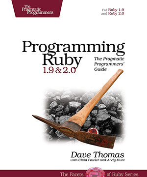
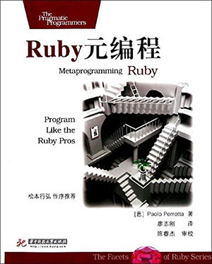
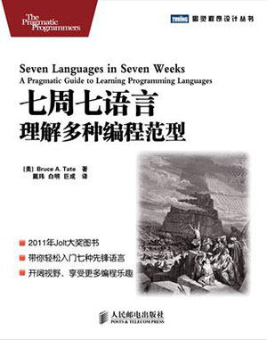

# 第一章 Ruby on Rails 概述

## 课程概要：

本课程主要讲解Ruby on Rails基础知识，包括对 Rails 开发环境、Ruby版本及 Ruby 管理工具 RVM 的简单介绍， Rails 项目中的文件含义的讲解，并为即将开始的 Rails 项目设计用户界面（UI）。

## 知识点：

1. Rails 开发环境概述
2. Rails 中的文件概述
3. 用户界面（UI）设计

## 课程背景

Ruby 是一门现代，面向对象的脚本语言。 它简洁、容易理解，可以让你快速地用代码自然、清晰表达想法。让你的程序能很简单被编写并且在几个月后还能很容易读懂。Ruby on Rails 是一个 Web 应用程序框架,是一个相对较新的 Web 应用程序框架，构建在 Ruby 语言之上。它被宣传为现有企业框架的一个替代，而它的目标，简而言之，就是让生活，至少是 Web 开发方面的生活，变得更轻松。通过本课程的学习，学员能够掌握如何搭建开发环境，了解 Rails 项目中文件的含义，并通过用户界面（UI）的设计，了解项目如何交付，以及要实现的目标。

# 1.1 Ruby on Rails 开发环境介绍

## 概要：

本课时介绍了 Ruby 及 Rails 的开发环境，RVM 和 Ruby 的安装，以及操作系统平台的选择。

## 知识点：

1. RVM 安装
2. Ruby 安装
3. Rails 安装
4. 代码管理

## 正文

### 1.1.1 Ruby 简介

Ruby, 是由 [松本行弘](https://github.com/matz) 先生在1995年正式发布的一种“面向对象编程”的脚本语言。推荐两本松本行弘的书籍。

<table>
<tr>
<th width="60%">封面</th>
<th>书评</th>
</tr>
<tr>
<td></td>
<td>《松本行弘的程序世界》是探索程序设计思想和方法的经典之作。作者从全局的角度，利用大量的程序示例及图表，深刻阐述了Ruby编程语言的设计理念，并以独特的视角考察了与编程相关的各种技术。</td>
</tr>
<tr>
<td></td>
<td>《代码的未来》是Ruby之父松本行弘的又一力作。作者对云计算、大数据时代下的各种编程语言以及相关技术进行了剖析，并对编程语言的未来发展趋势做出预测，内容涉及Go、VoltDB、node.js、CoffeeScript、Dart、MongoDB、摩尔定律、编程语言、多核、NoSQL等当今备受关注的话题。</td>
</tr>
</table>

再推荐大家几本 Ruby 开发给书，方便大家在学习 Rails 之余，更多的了解 Ruby。

封面 | 书名
--- | ---
 | Ruby 编程
 | Ruby 元编程
 | 七周七语言

更多 Ruby 的介绍，大家可以查看 [Ruby简介](https://www.ruby-lang.org/zh_cn/about/) 和 [20分钟体验 Ruby](https://www.ruby-lang.org/zh_cn/documentation/quickstart/)。

### 1.1.2 Rails 简介

我们使用的 Rails，就是基于 Ruby 开发的。Rails 的完整称呼是 Ruby on Rails，简称 Rails，是由 丹麦人 [David Heinemeier Hansson](http://david.heinemeierhansson.com/)（DHH）在2003年发布的开源 Web 框架。


图为穿着赛车服的 DHH，他和其他两队友获得了2014年勒芒24小时耐力赛GTE-Am组的冠军。

Rails 是一个基于 MVC 模式的高效的开发框架。在我刚刚接触 Rails 的2007年，很多人说不需要了解 Ruby，就可以使用 Rails 开发网站了，足见 Rails 的方便和快捷。而快速开发，也成为了 Rails 迅速获得众多开发人员喜爱的原因，众多大型网站，曾经或现在，正在使用着 Rails。Rails的受欢迎，也使得 Ruby 跻身最流行的开发语言排名前列。

注：勒芒大赛对车手是个极大的考验，FISA规定勒芒每部赛车由3名赛手分别驾驶(1980年中期以前为2名赛手)，即采用换人不换车的方法，所有的加油、换胎和维修时间都包括在24小时以内。最后，行驶里程最多的赛车获胜，一般一昼夜下来，成绩最好的赛车行驶的里程将近5000公里。每人连续驾驶时间不超过4小时，主车手总驾驶时间不超过14小时。勒芒环行跑道全长13公里，其中绝大部分是封闭式的公用高速公路，赛车在其2/3的路段上时速达370km/h左右，C组车一般只用3分钟左右的时间就能跑完一圈的路程。在跑道上有一段约6km的直路，赛车在这段路上飞速驶过，速度达到390km/h。

### 1.1.3 Ruby 安装

在安装 Rails 前，我们先来安装 Ruby 环境。这里，我们使用 rvm 这个工具。

注：以下安装及后续开发是在 Mac 系统上进行的，Windows 系统可以选择 [rubyinstaller](http://rubyinstaller.org/)。但是在 windows 开发 Rails 程序会遇到众多问题，建议大家安装虚拟机或者 Linux 双系统进行开发。

RVM 是 Ruby 管理工具，可以方便的安装、管理、切换多个 Ruby，管理 Gemset。

安装 RVM 的命令是：

```
curl -sSL https://get.rvm.io | bash -s stable
```

如果你已经安装了 RVM，可以用这个命令升级到最新的 stable 版本：

```
rvm get stable
```

在有的操作系统中，会给出这个提示：

```
  * To start using RVM you need to run `source /home/webmaster/.rvm/scripts/rvm`
    in all your open shell windows, in rare cases you need to reopen all shell windows.
```

这是你可以运行提示中的命令，`source /home/webmaster/.rvm/scripts/rvm`，或者退出当前登录 shell，再次登入。

我们在当前开发用户中安装 RVM，不必切换到 root 用户下。在生产服务器（Poduction）中，可以使用专门的项目管理用户，并具备 sudo 权限。我们在后面部署章节里会详细介绍。

安装完 RVM 后，我们可以使用 `rvm -v` 查看版本。我们使用 `rvm list known` 这个命令，可以查看可安装的 Ruby 版本：

```
% rvm list known
[ruby-]1.8.6[-p420]
[ruby-]1.8.7[-head] # security released on head
[ruby-]1.9.1[-p431]
[ruby-]1.9.2[-p330]
[ruby-]1.9.3[-p551]
[ruby-]2.0.0[-p598]
[ruby-]2.1.4
[ruby-]2.1[.5]
[ruby-]2.2.0
[ruby-]2.2-head
ruby-head
```

我们的课程里，将使用2.2.0这个版本：

```
rvm install 2.2.0
```

我们可以查看当前安装的 Ruby 版本：

```
% rvm list
=* ruby-2.2.0 [ x86_64 ]
```

如果你已经安装了其他版本的 Ruby，可以通过 `--default` 参数，设置 RVM 默认使用的 Ruby 版本：

```
rvm use 2.2.0 --default
```

看一下我们的 Ruby 版本：

```
% ruby -v
ruby 2.2.0p0 (2014-12-25 revision 49005) [x86_64-darwin13]
```

### 1.1.4 Rails 安装

安装 Rails 前，我们先创建一个 Gemset。Gemset 是一个独立的 Gem 集合，可以为每个项目设置自己的 Gemset，而不会相互干扰。：

```
rvm gemset create rails4.2
rvm use 2.2.0@rails4.2 --default
gem install rails -v 4.2.0 --no-document
```

注：`--no-document` 会跳过安装 ri 和 rdoc 文档，可以减少安装时间。

注：在一些系统环境中，还需要先安装 bundler，它的命令是 `gem install bundler`。Bundler 是Ruby 跟踪和安装 Gem 的工具，它的官网在这里 [http://bundler.io/](http://bundler.io/)。

在后面代码开发中，我们将继续使用 Ruby 2.2 和 Rails 4.2 版本。

这里有一份 [RVM实用指南](https://ruby-china.org/wiki/rvm-guide) 供大家参考。

### 1.1.5 操作系统

Ruby 和 Rails 的开发环境，可以在多个操作系统上安装，你可以选择 Mac 作为开发平台，也可以使用 ubuntu 等 linux 系统，作为开发和生产环境部署平台。windows 系统可以作为开发平台使用。

### 1.1.5 代码管理

在正式进入我们的教学前，请先熟悉一下 git 的[简单操作](http://gitbookio.gitbooks.io/progit/content/en/index.html)（[中文版](https://github.com/progit/progit/tree/master/zh)），Git是一个开源的分布式版本控制系统，用以有效、高速的处理从很小到非常大的项目版本管理。

我们的代码是放到 github 上的，你可以 clone 下来我们的代码，在本地调试。另外，你也需要准备好自己的编辑器。

github是一个打开托管平台，也是一个开发者的互动社区，你可以在上面阅读大量的开源代码，比如 [Ruby](https://github.com/ruby/ruby)，[Rails](https://github.com/rails/rails)，还有我们每一个章节的 [代码](https://github.com/liwei78/rails-practice-code)。

墙裂建议你注册一个 github 的账号，把你学习的代码和经验总结放到上面去。代码可以创建代码仓库（repo），学习经验可以创建 github 的 wiki 页面，或者使用 [markdown](https://help.github.com/articles/markdown-basics/) 来编写。对于一些实用的代码片段，可以使用 [gist](https://gist.github.com/) 保存。


### 阅读

我推荐大家阅读 [Rails 入门](http://guides.rubyonrails.org/getting_started.html) 介绍，它的 [中文](http://guides.ruby-china.org/getting_started.html) 内容在这里。
