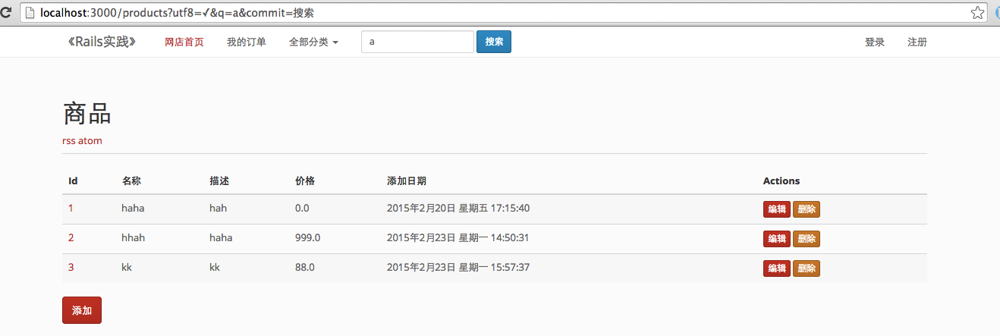

# 3.2 表单（Form）

## 概要：

本课时讲解 Rails 如何通过表单（Form）传递数据，以及表单中的辅助方法使用，并实现登陆注册功能。

## 知识点：

1. 表单
2. 表单中的辅助方法（helper）
3. 表单绑定模型（Model）
4. 注册和登录

## 正文

### 3.2.1 搜索表单（Form）

如果我们的表单不产生某个资源的状态改变，我们可以使用 GET 发送表单，这么说很抽象，比如一个搜索表单，就可以是 GET 表单。

我们在页面的导航栏上，增加一个搜索框：

```
<%= form_tag(products_path, method: "get") do %>
  <%= label_tag(:q) %>
  <%= text_field_tag(:q) %>
  <%= submit_tag("搜索") %>
<% end %>
```

`form_tag` 产生了一个表单，我们设定它的 `method` 是 `get`，它的 `action` 地址是 `products_path`，我们也可以设定一个 hash 来制定地址，比如：

```
form_tag({action: "search"}, method: "get") do
```

这需要你在 `products` 里再增加一个 `search` 方法，否则，你会得到一个 `No route matches {:action=>"search", :controller=>"products"}` 的提示，这告诉我们，`form_tag` 的第一个参数需要是一个可解析的 `routes` 地址。当然，你也可以给它一个字符串，这个地址即便不存在，也不会造成 `no route` 提示了。

```
form_tag("/i/dont/know", method: "get") do
```

这并不是我们最终的代码，我们还需要增加一些附加的属性，让我们的式样看起来正常一些。而且我用了 `params[:q]` 这个方法，获得地址中的 `q` 参数，把搜索的内容放回到搜索框中。



我们可以在 controller 里，使用 ActiveRecord 的 where 方法查询传入的参数，我们页可以使用 ()[https://github.com/activerecord-hackery/ransack] 这种 gem 来实现搜索功能。

ransack 是一个 metasearch 的 gem，实现它非常的方便。我们把它加入到 gemfile 里：

```
gem 'ransack'
```

我们在视图里，使用 ransack 提供的辅助方法，来实现表单:

```
<%= search_form_for @q, html: { class: "navbar-form navbar-left" } do |f| %>
  <div class="form-group">
    <%= f.search_field :name_cont, class: "form-control", placeholder: "输入商品名称" %>
  </div>
<% end %>
```

提示：如果每个页面都包含这个搜索框，但是不见得每个页面都有 @q 这个实例，所以我们可以自己写一个表单，实现搜索：

```
<%= form_tag products_path, method: :get, class: "navbar-form navbar-left" do %>
  <div class="form-group">
    <%= text_field_tag "q[name_cont]", params["q"] && params["q"]["name_cont"], class: "form-control input-sm search-form", placeholder: "输入商品名称" %>
  </div>
<% end %>
```

在商品的 controller 中，我们修改 index 方法：

```
def index
  @q = Product.ransack(params[:q])
  @products = @q.result(distinct: true)
end
```

好了，一个简单的查询实现了。这里我们使用的是 `name_cont` 来实现模糊查询，[文档](https://github.com/activerecord-hackery/ransack) 上提供了详尽的方法，实现更复杂的查询。

### 3.2.2 常用的表单辅助方法

在我们使用 `form_tag` 的同时，我们还需要一些辅助方法来生成表单控件。

```
<%= text_area_tag(:message, "Hi, nice site", size: "24x6") %>
<%= password_field_tag(:password) %>
<%= hidden_field_tag(:parent_id, "5") %>
<%= search_field(:user, :name) %>
<%= telephone_field(:user, :phone) %>
<%= date_field(:user, :born_on) %>
<%= datetime_field(:user, :meeting_time) %>
<%= datetime_local_field(:user, :graduation_day) %>
<%= month_field(:user, :birthday_month) %>
<%= week_field(:user, :birthday_week) %>
<%= url_field(:user, :homepage) %>
<%= email_field(:user, :address) %>
<%= color_field(:user, :favorite_color) %>
<%= time_field(:task, :started_at) %>
<%= number_field(:product, :price, in: 1.0..20.0, step: 0.5) %>
<%= range_field(:product, :discount, in: 1..100) %>
```
解析后的代码是：

```
<textarea id="message" name="message" cols="24" rows="6">Hi, nice site</textarea>
<input id="password" name="password" type="password" />
<input id="parent_id" name="parent_id" type="hidden" value="5" />
<input id="user_name" name="user[name]" type="search" />
<input id="user_phone" name="user[phone]" type="tel" />
<input id="user_born_on" name="user[born_on]" type="date" />
<input id="user_meeting_time" name="user[meeting_time]" type="datetime" />
<input id="user_graduation_day" name="user[graduation_day]" type="datetime-local" />
<input id="user_birthday_month" name="user[birthday_month]" type="month" />
<input id="user_birthday_week" name="user[birthday_week]" type="week" />
<input id="user_homepage" name="user[homepage]" type="url" />
<input id="user_address" name="user[address]" type="email" />
<input id="user_favorite_color" name="user[favorite_color]" type="color" value="#000000" />
<input id="task_started_at" name="task[started_at]" type="time" />
<input id="product_price" max="20.0" min="1.0" name="product[price]" step="0.5" type="number" />
<input id="product_discount" max="100" min="1" name="product[discount]" type="range" />
```
更多的表单辅助方法，建议大家直接查看这个部分的 [源代码](https://github.com/rails/rails/blob/master/actionview/lib/action_view/helpers/form_tag_helper.rb)，我一直认为源代码是最好的教材。

### 3.2.3 模型（Model）的辅助方法

我们还可以使用不带有 `_tag` 结尾的辅助方法，来显示一个模型（Model） 实例（Instance），比如我们的 `@product`，可以在它的编辑页面中这样来写：

```
<%= text_field(:product, :name) %>
```

他会给我们

```
<input type="text" value="测试商品" name="product[name]" id="product_name">
```

它接受两个参数，并把它拼装成 `product[name]`，并且把 `value` 赋予这个属性的值。我们提交表单的时候，Rails 会把它解释成 `product: {name: '测试商品', ...}`，这样，`Product.create(...)` 可以添加这个商品信息到数据库中了。

不过这样做会有个问题，这个商品会有很多属性需要我们填写，会让代码变得“啰嗦”。这时，我们可以把这个实例，绑定到表单上。

注：说模型对象，通常指 `Product` 这个模型，说模型实例，指 `@product`。一些文档上并不区分这种称呼，个人觉得容易混淆。

### 3.2.4 把模型（Model）绑定到表单上

来看看我们的商品添加界面使用的表单吧，它在这里 `app/views/products/_form.html.erb`

```
<%= form_for @product, :html => { :class => 'form-horizontal' } do |f| %>
```

这里我们用了 `form_for` 这个方法，它可以将一个资源和表单绑定，这里我们将 `controller` 中的 @product 和它绑定。`form_for` 会判断 @product 是否为一个新的实例（你可以看看 `@product.new_record?`），从而将 `form` 的地址指向 `create` 还是 `update` 方法，这是符合我们之前提到的 REST 风格。

当然，大多数浏览器是不支持`PUT`，`PATCH`，`DELETE` 方法的，浏览器在提交表单时，只会是 `GET` 或 `POST`，这时，form_tag 会创建一个隐藏空间，来告诉 Rails 这是一个什么动作。而 `form_for` 会根据实例，来自动判断。

```
<input name="_method" type="hidden" value="patch" />
```

在我们显示商品属性的时候，用到了 `f.text_field :name` 这个辅助方法，这样，我们不用再为每一个 `text_field` 去声明这是哪个实例了。`f` 是一个表单构造器（Form Builder）实例，你可以在 [这里](http://api.rubyonrails.org/classes/ActionView/Helpers/FormBuilder.html) 看到更多它的介绍。

我们可以自己定义 `FormBuilder`，以节省更多的代码，也可以使用 [simple form](https://github.com/plataformatec/simple_form)，[formtastic](https://github.com/justinfrench/formtastic) 这种 Gem。推荐 [ruby-toolbox.com](https://www.ruby-toolbox.com) 这个网站，你可以发现其他的好用的 Gem。

### 3.2.5 注册和登录

现在，我们实现一个很重要的功能，注册和登录。我们不需要从头实现它，因为我们有 Rails 十大必备 Gem 中的第一位：[Devise](https://github.com/plataformatec/devise) 可以选择。

在 `Gemfile` 中增加 

```
gem 'devise'
```

在 `bundle install` 之后，我们需要创建配置文件：用户（User）

```
% rails generate devise:install User
create  config/initializers/devise.rb
create  config/locales/devise.en.yml
 ===============================================================================

Some setup you must do manually if you haven't yet:

  1. Ensure you have defined default url options in your environments files. Here
     is an example of default_url_options appropriate for a development environment
     in config/environments/development.rb:

       config.action_mailer.default_url_options = { host: 'localhost', port: 3000 }

     In production, :host should be set to the actual host of your application.

  2. Ensure you have defined root_url to *something* in your config/routes.rb.
     For example:

       root to: "home#index"

  3. Ensure you have flash messages in app/views/layouts/application.html.erb.
     For example:

       <p class="notice"><%= notice %></p>
       <p class="alert"><%= alert %></p>

  4. If you are deploying on Heroku with Rails 3.2 only, you may want to set:

       config.assets.initialize_on_precompile = false

     On config/application.rb forcing your application to not access the DB
     or load models when precompiling your assets.

  5. You can copy Devise views (for customization) to your app by running:

       rails g devise:views

===============================================================================
```

之后，我们创建用户（User）模型：

```
% rails generate devise User
      invoke  active_record
      create    db/migrate/20150224071758_devise_create_users.rb
      create    app/models/user.rb
      invoke    test_unit
      create      test/models/user_test.rb
      create      test/fixtures/users.yml
      insert    app/models/user.rb
       route  devise_for :users
```

之后，我们创建用户（User）需要的 `views`：

```
% rails g devise:views
      invoke  Devise::Generators::SharedViewsGenerator
      create    app/views/users/shared
      create    app/views/users/shared/_links.html.erb
      invoke  form_for
      create    app/views/users/confirmations
      create    app/views/users/confirmations/new.html.erb
      create    app/views/users/passwords
      create    app/views/users/passwords/edit.html.erb
      create    app/views/users/passwords/new.html.erb
      create    app/views/users/registrations
      create    app/views/users/registrations/edit.html.erb
      create    app/views/users/registrations/new.html.erb
      create    app/views/users/sessions
      create    app/views/users/sessions/new.html.erb
      create    app/views/users/unlocks
      create    app/views/users/unlocks/new.html.erb
      invoke  erb
      create    app/views/users/mailer
      create    app/views/users/mailer/confirmation_instructions.html.erb
      create    app/views/users/mailer/reset_password_instructions.html.erb
      create    app/views/users/mailer/unlock_instructions.html.erb
```

最后，更新 db：

```
rake db:migrate
```
在使用注册登录功能前，我们修改一下布局页面，增加几个链接：

```
<% if user_signed_in? %>
  <li><%= link_to current_user.email, profile_path %></li>
  <li><%= link_to "退出", destroy_user_session_path, method: :delete %></li>
<% else %>
  <li><%= link_to "登录", new_user_session_path %></li>
  <li><%= link_to "注册", new_user_registration_path %></li>
<% end %>
```

现在，我们可以使用注册登录功能了，是不是很简单呢？

接下来，我们对 Devise 创建的页面做一点修改，同时看看 Rails 如何实现表单的。

我们登录界面在 `app/views/users/sessions/new.html.erb`，我们把它改一下，符合我们页面风格，具体如何使用 html 代码，可以参考 [http://bootswatch.com/simplex/](http://bootswatch.com/simplex/)。

本章的代码在[这里](https://github.com/liwei78/rails-practice-code/tree/master/chapter_3/shop2)，希望可以帮助大家理解表单和其使用。
