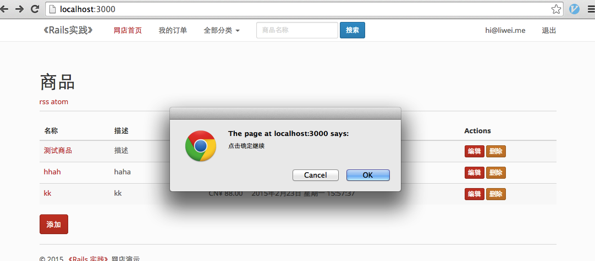

# 3.3 视图（View）中的 ajax 交互

## 概要：

本课时通过商品的添加，编辑和删除，讲解视图中如何使用 ujs，jquery 和 json，实现无刷新情况下的页面更新。

## 知识点：

1. jquery
2. ujs
3. ajax
4. json

## 正文

上一节，我们讲解了 Rails 中的实图（View），我们再回顾一下这个视图是如何产生的：我们向服务器发起一个请求，比如某个地址，服务器返给我们结果，查看源代码，它是一篇 `HTML` 的代码。

我们每次请求一个地址，都会给我们完整的 HTML 结果，对于内容较少的网页，传输起来还是很快的，但是对于内容多的网页，大篇的结果自然会拖慢页面显示。

当我们浏览页面的时候，并不期望总是刷新整个页面，因为它没必要。现在我们有 ajax 技术，可以只加载和显示部分页面代码。举个简单的例子：当我们提交了一条评论，页面上自动显示出我们提交的评论内容。我们点击购买按钮，页面上就提示我们购物车里增加了一个商品。而这些，都不必要刷新整个页面。

ajax 是 Asynchronous Javascript And XML 的缩写，含义是异步的 js 和 XML 交互技术。XML，可扩展标记语言，我们使用的 HTML 是基于其发展起来的。

下面我们看下 Rails 是如何把 ajax 技术应用在视图（View）中的。

### 3.3.1 ujs

我们在 Gemfile 中已经使用了 `gem 'jquery-rails'` 这个 Gem，它可以让我们在 `application.js` 中增加这两行：

```
//= require jquery
//= require jquery_ujs
```

[jQuery](http://jquery.com/) 是一个轻量级的 js 库，可以方便的处理HTML，事件（Event），动态效果，为页面提供 ajax 交互。jQuery 有很完善的文档及演示代码，以及大量的插件。

Rails 使用一种叫 [ujs](https://github.com/rails/jquery-ujs)（Unobtrusive JavaScript）的技术，将 js 应用到 DOM 上。我们来看一个例子：



我们给删除连接增加了一个参数：

```
<%= link_to "删除", product, :method => :delete, :data => { :confirm => "点击确定继续" } %>
```

来看看我们的 HTML：

```
<a data-confirm="点击确定继续" rel="nofollow" data-method="delete" href="/products/1">删除</a>
```

辅助方法 `link_to` 使用了 `:data => { :confirm => "点击确定继续" }` 这个参数，为我们添加了 `data-confirm="点击确定继续"` 这样的 HTML 代码，之后 ujs 将它处理成一个弹出框。

我们可以给 `a` 标签增加 `data-disable-with` 属性，当点击它的时候，使它禁用，并提示文字信息。这样可以防止用户多次提交表单，或者重复的链接操作。

我们为商品表单中的按钮，增加这个属性：

```
<%= f.submit nil, :data => { :"disable-with" => "请稍等..." } %>
```

当我们提交表单时，会有：


如果你还没看清楚效果，页面就已经跳转了，我们可以给 create 方法增加一个 `sleep 10`：

```
def create
  sleep 10
  @product = Product.new(product_params)
  ...
```

除了以上两个例子，我们在商品列表中，在删除按钮上，增加了 `:method => :delete` 属性，这为我们的连接上增加了 `data-method="delete"` 属性，这样，ujs 会把这个点击动作，会发送一个 `delete` 请求删除资源，这是符合 REST 要求的。 

更多 ujs 支持的方法，我们在 [这里](https://github.com/rails/jquery-ujs/blob/master/src/rails.js) 看到。

### 3.3.2 无刷新页面的操作

ujs 给我们带来的一些便利还不止这些，我们来点复杂的：在不刷新页面的情形下，添加一个商品，并显示在列表中。

我们现在的列表页是这样的：


现在点击添加，我们会进入到 `http://localhost:3000/products/new`，我们并不改变它，毕竟在某些 js 失效的情形下，点击这个按钮还是要跳转到 new 页面的。

我们希望给页面增加一个表单，来输入新商品的信息，在这之前，我们想更酷一点，我们使用 `modal` 来显示这个表单：

```
<%= link_to t('.new', :default => t("helpers.links.new")), new_product_path, :class => 'btn btn-primary', data: {toggle: "modal", target: "#productForm"} %>
```

ujs 允许我们在 link 上增加额外的属性，当我们再次点击 `添加` 按钮时：


当然我做了其他一些修改，你可以在 [这里](https://github.com/liwei78/rails-practice-code/tree/master/chapter_3/shop3.3) 找到完整的代码。

为了产生一个 ajax 的请求，我们在表单上增加一个参数 `remote: true`：

```
<%= form_for @product, remote: true, :html => { :class => 'form-horizontal' } do |f| %>
```

这时，ujs 将会调用 `jQuery.ajax()` 提交表单，此时的请求是一个 `text/javascript` 请求，Rails 会返回给我们相应的结果，在我们的 action 里，增加这样的声明：

```
respond_to do |format|
  if @product.save
    format.html {...}
    format.js
  else
    format.html {...}
    format.js
  end
end
```

在保存（save）成功时，我们返回给视图（view）一个 js 片段，它可以在浏览器端执行。

我们创建一个新文件 `app/views/products/create.js.erb`，在这里，我们将新添加商品，显示在上面的列表中。

```
$('#productsTable').prepend('<%= j render(@product) %>');
$('#productFormModal').modal('hide');
```

我们使用 `.js.erb` 的文件，方便我们在 js 文件里插入 erb 的语法。

我们将一行商品信息使用 `prepend` 方法，插入到 `productsTable` 的最上面，`j` 方法将我们的字符串转换成 js 片段。

好了，你可以试一试效果了。

你可能也像我一样做了一些测试，导致插入了很多测试数据，为了继续不刷新页面就完成删除操作，我们给 `删除` 按钮上也增加一个 ajax 调用。

我们先给每一行记录，增加一个唯一的 ID 标识，通常使用“名字 + id”的形式，我们还需要给删除连接增加 `remote: true` 属性，我们编辑 `app/views/products/_product.html.erb`：

```
<tr id="product_<%= product.id %>">
...
<%= link_to "删除", product, :method => :delete, remote: true, :data => { :confirm => "点击确定继续" }, :class => 'btn btn-danger btn-xs' %>
```

我们再增加一个文件以返回 js 片段给浏览器执行 `app/views/products/destroy.js.erb`：

```
$('#product_<%= @product.id %>').fadeOut();
```

你可以再试试看。

现在，我们看一下添加商品时的返回结果：

```
$('#productsTable').prepend('<tr id=\"product_14\">\n  <td><a href=\"/products/14\">kkk<\/a><\/td>\n  <td>jjj<\/td>\n  <td class=\"text-right\">CN¥ 999.00<\/td>\n  <td>2015年2月26日 星期四 23:57:55<\/td>\n  <td>\n    <a class=\"btn btn-primary btn-xs\" href=\"/products/14/edit\">编辑<\/a>\n    <a data-confirm=\"点击确定继续\" class=\"btn btn-danger btn-xs\" data-remote=\"true\" rel=\"nofollow\" data-method=\"delete\" href=\"/products/14\">删除<\/a>\n  <\/td>\n<\/tr>\n');
$('#productFormModal').modal('hide');
```

这里面大部分代码是不必要的 HTML代码，如何让我们的返回结果更简洁呢？我们现在发送个是 `text/javascript` 请求，返回给我们的是 js 片段。下一节我们发送 'json' 请求，我们在浏览器端使用 js 处理返回的 json 数据。

### 3.3.3 jQuery 和 json

首先，我们把请求类型改成 json：

```
<%= form_for @product, remote: true, data: { type: "json" }, :html => { :class => 'form-horizontal' } do |f| %>
```

这时我们发送的请求类型，是 `application/json`
