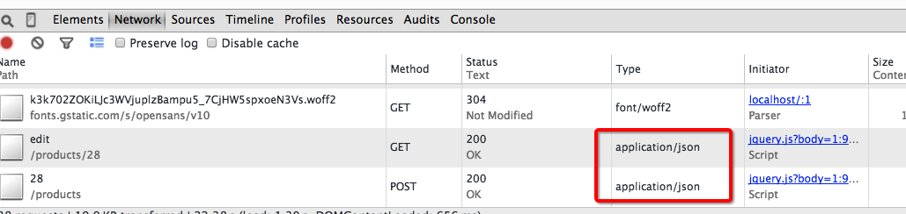
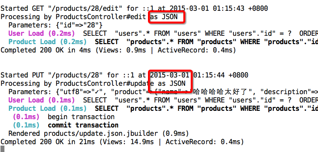

# 3.3 视图中的 AJAX 交互

## 概要：

本课时通过对商品的添加、编辑和删除，讲解视图中如何使用 UJS，jQuery 和 JSON，实现无刷新情况下的页面更新。

## 知识点：

1. jQuery
2. UJS
3. AJAX
4. JSON

## 正文

上一节，我们讲解了 Rails 中的视图（View），我们再回顾一下这个视图是如何产生的：我们向服务器发起一个请求，服务器返给我们结果，查看源代码，它是一篇 `HTML` 的代码。

我们每次请求一个地址，都会给我们完整的 HTML 结果，对于内容较少的网页，传输起来还是很快的，但是对于内容多的网页，大篇的结果自然会拖慢页面显示。

当我们浏览页面的时候，并不期望总是刷新整个页面，因为它没必要。现在我们有 ajax 技术，可以只加载和显示部分页面代码。举个简单的例子：当我们提交了一条评论，页面上自动显示出我们提交的评论内容。我们点击购买按钮，页面上就提示我们购物车里增加了一个商品。而这些，都不必要刷新整个页面。

ajax 是 Asynchronous Javascript And XML 的缩写，含义是异步的 js 和 XML 交互技术。XML，可扩展标记语言，我们使用的 HTML 是基于其发展起来的。

下面我们看下 Rails 是如何把 ajax 技术应用在视图（View）中的。

### 3.3.1 ujs

我们在 Gemfile 中已经使用了 `gem 'jquery-rails'` 这个 Gem，它可以让我们在 `application.js` 中增加这两行：

```
//= require jquery
//= require jquery_ujs
```

[jQuery](http://jquery.com/) 是一个轻量级的 js 库，可以方便的处理HTML，事件（Event），动态效果，为页面提供 ajax 交互。jQuery 有很完善的文档及演示代码，以及大量的插件。

Rails 使用一种叫 [ujs](https://github.com/rails/jquery-ujs)（Unobtrusive JavaScript）的技术，将 js 应用到 DOM 上。我们来看一个例子：


我们已经给删除连接增加了两个属性：

```
<%= link_to "删除", product, :method => :delete, :data => { :confirm => "点击确定继续" } %>
```

来看看我们的 HTML：

```
<a data-confirm="点击确定继续" rel="nofollow" data-method="delete" href="/products/1">删除</a>
```

辅助方法 `link_to` 使用了 `:data => { :confirm => "点击确定继续" }` 这个属性，为我们添加了 `data-confirm="点击确定继续"` 这样的 HTML 代码，之后 ujs 将它处理成一个弹出框。

在删除按钮上，还有 `:method => :delete` 属性，这为我们的连接上增加了 `data-method="delete"` 属性，这样，ujs 会把这个点击动作，会发送一个 `delete` 请求删除资源，这是符合 REST 要求的。 

我们可以给 `a` 标签增加 `data-disable-with` 属性，当点击它的时候，使它禁用，并提示文字信息。这样可以防止用户多次提交表单，或者重复的链接操作。

我们为商品表单中的按钮，增加这个属性：

```
<%= f.submit nil, :data => { :"disable-with" => "请稍等..." } %>
```

当我们提交表单时，会有：


如果你还没看清楚效果，页面就已经跳转了，我们可以给 create 方法增加一个 `sleep 10`：

```
def create
  sleep 10
  @product = Product.new(product_params)
  ...
```

更多 ujs 支持的属性，我们在 [这里](https://github.com/rails/jquery-ujs/blob/master/src/rails.js) 看到。

### 3.3.2 无刷新页面的操作

ujs 给我们带来的一些便利还不止这些，我们来点复杂的：在不刷新页面的情形下，添加一个商品，并显示在列表中。

我们现在的列表页是这样的：


现在点击添加，我们会进入到 `http://localhost:3000/products/new`，我们并不改变它，毕竟在某些 js 失效的情形下，点击这个按钮还是要跳转到 new 页面的。

我们希望给页面增加一个表单，来输入新商品的信息，在这之前，我们想更酷一点，我们使用 `modal` 来显示这个表单：

```
<%= link_to t('.new', :default => t("helpers.links.new")), new_product_path, :class => 'btn btn-primary', data: {toggle: "modal", target: "#productForm"} %>
```

ujs 允许我们在 link 上增加额外的属性，当我们再次点击 `添加` 按钮时：


当然我做了其他一些修改，你可以在 [这里](https://github.com/liwei78/rails-practice-code/tree/master/chapter_3/shop3.3) 找到完整的代码。

为了产生一个 ajax 的请求，我们在表单上增加一个参数 `remote: true`：

```
<%= form_for @product, remote: true, :html => { :class => 'form-horizontal' } do |f| %>
```

这时，ujs 将会调用 `jQuery.ajax()` 提交表单，此时的请求是一个 `text/javascript` 请求，Rails 会返回给我们相应的结果，在我们的 action 里，增加这样的声明：

```
respond_to do |format|
  if @product.save
    format.html {...}
    format.js
  else
    format.html {...}
    format.js
  end
end
```

在保存（save）成功时，我们返回给视图（view）一个 js 片段，它可以在浏览器端执行。

我们创建一个新文件 `app/views/products/create.js.erb`，在这里，我们将新添加商品，显示在上面的列表中。

```
$('#productsTable').prepend('<%= j render(@product) %>');
$('#productFormModal').modal('hide');
```

我们使用 `.js.erb` 的文件，方便我们在 js 文件里插入 erb 的语法。

我们将一行商品信息使用 `prepend` 方法，插入到 `productsTable` 的最上面，`j` 方法将我们的字符串转换成 js 片段。

好了，你可以试一试效果了。

你可能也像我一样做了一些测试，导致插入了很多测试数据，为了继续不刷新页面就完成删除操作，我们给 `删除` 按钮上也增加一个 ajax 调用。

我们先给每一行记录，增加一个唯一的 ID 标识，通常使用“名字 + id”的形式，我们还需要给删除连接增加 `remote: true` 属性，我们编辑 `app/views/products/_product.html.erb`：

```
<tr id="product_<%= product.id %>">
...
<%= link_to "删除", product, :method => :delete, remote: true, :data => { :confirm => "点击确定继续" }, :class => 'btn btn-danger btn-xs' %>
```

我们再增加一个文件以返回 js 片段给浏览器执行 `app/views/products/destroy.js.erb`：

```
$('#product_<%= @product.id %>').fadeOut();
```

你可以再试试看。

现在，我们看一下添加商品时的返回结果：

```
$('#productsTable').prepend('<tr id=\"product_14\">\n  <td><a href=\"/products/14\">kkk<\/a><\/td>\n  <td>jjj<\/td>\n  <td class=\"text-right\">CN¥ 999.00<\/td>\n  <td>2015年2月26日 星期四 23:57:55<\/td>\n  <td>\n    <a class=\"btn btn-primary btn-xs\" href=\"/products/14/edit\">编辑<\/a>\n    <a data-confirm=\"点击确定继续\" class=\"btn btn-danger btn-xs\" data-remote=\"true\" rel=\"nofollow\" data-method=\"delete\" href=\"/products/14\">删除<\/a>\n  <\/td>\n<\/tr>\n');
$('#productFormModal').modal('hide');
```

这里面大部分代码是不必要的 HTML代码，如何让我们的返回结果更简洁呢？我们现在发送个是 `text/javascript` 请求，返回给我们的是 js 片段。下一节我们发送 'json' 请求，我们在浏览器端使用 js 处理返回的 json 数据。

### 3.3.3 json 数据的页面处理

为了和添加商品区分开，我们在修改商品时，使用 `json` 来处理数据，而且也在一个 `modal` 中完成。

```
<%= link_to t('.edit', :default => t("helpers.links.edit")), edit_product_path(product), remote: true, data: { type: 'json' }, :class => 'btn btn-primary btn-xs editProductLink' %>
```
我们给编辑链接，增加了 `remote: true, data: { type: 'json' }`，这时我们没有打开`modal`，我们把 js 代码写在 coffeescript 中。

我们新建一个文件，`app/assets/javascripts/products.coffee`。这个文件我们只在商品页面使用，所以不必把它放到 `simplex.js` 中，现在我们只在商品的 `index.html.erb` 中使用它，所以：

```
<%= content_for :page_javascript do %>
<%= javascript_include_tag "products" %>
...
```

当我们点击编辑按钮时，我们期望几件事：

1. 打开 `modal` 层，显示编辑表单
2. 读取这个商品的信息（json 格式），把需要编辑的内容填入表单

好，我们写上这部分代码：

```
jQuery ->
  $(".editProductLink")
    .on "ajax:success", (e, data, status, xhr) ->
      $('#alert-content').hide() [1]
      $('#editProductFormModal').modal('show') [2]
      $('#editProductName').val(data['name']) [3]
      $('#editProductDescription').val(data['description']) [3]
      $('#editProductPrice').val(data['price']) [3]
      $("#editProductForm").attr('action', '/products/'+data['id']) [4]

```

* [1] 我们隐藏错误信息提示框
* [2] 显示层
* [3] 填入编辑的信息
* [4] 更改表单提交的地址

再来看看我们的编辑表单：

```
...
<%= form_tag "", method: :put, remote: true, data: { type: "json" }, id: "editProductForm", class: "form-horizontal" do %>
...
<%= text_field_tag "product[name]", "", :class => 'form-control', id: "editProductName", required: true %>
...
<%= text_field_tag "product[description]", "", :class => 'form-control', id: "editProductDescription" %>
...
<%= text_field_tag "product[price]", "", :class => 'form-control', id: "editProductPrice" %>
...
```

我们让表单提交的地址，可以根据选择的商品而改变，同时我们设定它的 type 为 json 格式。

我们为每一个输入框，设定了 ID，这样，我们用读取的 json 信息，分别填入对应的编辑框内。

然后，我们改动一下 controller 中的方法：

```
def edit
  respond_to do |format
    format.html
    format.json { render json: @product, status: :ok, location: @product } [1]
  end
end
```

* [1] 我们让 edit 方法，返回给我们商品的 json 格式信息。

```
def update
  respond_to do |format|
    if @product.update(product_params)
      format.html { redirect_to @product, notice: 'Product was successfully updated.' }
      format.json [1]
    else
      format.html { render :edit }
      format.json { render json: @product.errors.full_messages.join(', '), status: :error } [2]
    end
  end
end
```

* [1] 我们让 update 方法，可以接受 json 的请求，
* [2] 当 update 失败时，我们需要把失败的原因告诉客户端，它也是 json 格式的。

当我们需要考虑 update 方法会有成功和失败两种可能时，我们的 ajax 调用，就要这样来写了：

```
$("#editProductForm")
  .on "ajax:success", (e, data, status, xhr) ->
    $('#editProductFormModal').modal('hide') [1]
    $('#product_'+data['id']+'_name').html(  data['name'] ) [2]
    $('#product_'+data['id']+'_description').html(  data['description'] ) [2]
    $('#product_'+data['id']+'_price').html(  data['price'] ) [2]
  .on "ajax:error", (e, xhr, status, error) ->
    $('#alert-content').show() [3]
    $('#alert-content #msg').html( xhr.responseText ) [4]
```

* [1] 我们隐藏这个层
* [2] 当成功的时候，我们把修改好的信息，放回到我们的页面中
* [3] 当失败的时候，我们显示个错误信息提示框
* [4] 我们向这个框内，填入信息

更多 controller 的介绍，后面章节还会有，这里我们要了解的是，我们页面拿到的信息，不再是 js 片段，而是 json 格式的数据。

当我们书里大量数据的时候，json 明显要比 js 片段更节省传输空间，我们也可以把处理动作写到独立的 js 文件中，不过，json 格式返回给我们的，是 9.9，而我们页面显示的是格式化后的 `CN¥ 9.90`，如果我们想把处理好格式的数据返还回来，该如何处理呢？

我们可以使用 jbuilder 做这件事，我们新建一个 `update.json.jbuilder`：

```
json.id @product.id
json.name link_to @product.name, product_path(@product) [1]
json.description @product.description
json.price number_to_currency(@product.price) [2]
```

* [1] 我们把链接的地址用辅助方法生成
* [2] 我们用 number_to_currency 方法把价格格式化，这里可以使用辅助方法

如何知道我们的确使用的是 json 数据呢？我们可以查看浏览器的控制台，或者查看命令行的 log 输出。





在 [这里](https://github.com/liwei78/rails-practice-code/tree/master/chapter_3/shop3.3) 可以找到我调试好的代码。

在实践开发中，我们会从服务端拿到很多的内容，比如几十条订单信息，我们可以用上面的方法把它们显示到页面上，也可以使用 [http://handlebarsjs.com/](http://handlebarsjs.com/) 这种模板引擎，使页面和逻辑更加的独立，清晰。当我们面对少量的内容时，js 片段要比写一大堆 coffeescript 来的更省事些。所以，我们在确定选用哪种方式处理，要看我们面对的是怎样的问题。

最后附上两个附表。

附表一，当我们 `render json:..., status: :ok, ...` 时，status 和符号的对应，可以在这里找到，一般我们用 :ok, :create, :success, :error 就足够了。

<table class="responsive">
  <thead>
    <tr>
      <th>Response Class</th>
      <th>HTTP Status Code</th>
      <th>Symbol</th>
    </tr>
  </thead>
  <tbody>
    <tr>
      <td><strong>Informational</strong></td>
      <td>100</td>
      <td>:continue</td>
    </tr>
    <tr>
      <td></td>
      <td>101</td>
      <td>:switching_protocols</td>
    </tr>
    <tr>
      <td></td>
      <td>102</td>
      <td>:processing</td>
    </tr>
    <tr>
      <td><strong>Success</strong></td>
      <td>200</td>
      <td>:ok</td>
    </tr>
    <tr>
      <td></td>
      <td>201</td>
      <td>:created</td>
    </tr>
    <tr>
      <td></td>
      <td>202</td>
      <td>:accepted</td>
    </tr>
    <tr>
      <td></td>
      <td>203</td>
      <td>:non_authoritative_information</td>
    </tr>
    <tr>
      <td></td>
      <td>204</td>
      <td>:no_content</td>
    </tr>
    <tr>
      <td></td>
      <td>205</td>
      <td>:reset_content</td>
    </tr>
    <tr>
      <td></td>
      <td>206</td>
      <td>:partial_content</td>
    </tr>
    <tr>
      <td></td>
      <td>207</td>
      <td>:multi_status</td>
    </tr>
    <tr>
      <td></td>
      <td>208</td>
      <td>:already_reported</td>
    </tr>
    <tr>
      <td></td>
      <td>226</td>
      <td>:im_used</td>
    </tr>
    <tr>
      <td><strong>Redirection</strong></td>
      <td>300</td>
      <td>:multiple_choices</td>
    </tr>
    <tr>
      <td></td>
      <td>301</td>
      <td>:moved_permanently</td>
    </tr>
    <tr>
      <td></td>
      <td>302</td>
      <td>:found</td>
    </tr>
    <tr>
      <td></td>
      <td>303</td>
      <td>:see_other</td>
    </tr>
    <tr>
      <td></td>
      <td>304</td>
      <td>:not_modified</td>
    </tr>
    <tr>
      <td></td>
      <td>305</td>
      <td>:use_proxy</td>
    </tr>
    <tr>
      <td></td>
      <td>306</td>
      <td>:reserved</td>
    </tr>
    <tr>
      <td></td>
      <td>307</td>
      <td>:temporary_redirect</td>
    </tr>
    <tr>
      <td></td>
      <td>308</td>
      <td>:permanent_redirect</td>
    </tr>
    <tr>
      <td><strong>Client Error</strong></td>
      <td>400</td>
      <td>:bad_request</td>
    </tr>
    <tr>
      <td></td>
      <td>401</td>
      <td>:unauthorized</td>
    </tr>
    <tr>
      <td></td>
      <td>402</td>
      <td>:payment_required</td>
    </tr>
    <tr>
      <td></td>
      <td>403</td>
      <td>:forbidden</td>
    </tr>
    <tr>
      <td></td>
      <td>404</td>
      <td>:not_found</td>
    </tr>
    <tr>
      <td></td>
      <td>405</td>
      <td>:method_not_allowed</td>
    </tr>
    <tr>
      <td></td>
      <td>406</td>
      <td>:not_acceptable</td>
    </tr>
    <tr>
      <td></td>
      <td>407</td>
      <td>:proxy_authentication_required</td>
    </tr>
    <tr>
      <td></td>
      <td>408</td>
      <td>:request_timeout</td>
    </tr>
    <tr>
      <td></td>
      <td>409</td>
      <td>:conflict</td>
    </tr>
    <tr>
      <td></td>
      <td>410</td>
      <td>:gone</td>
    </tr>
    <tr>
      <td></td>
      <td>411</td>
      <td>:length_required</td>
    </tr>
    <tr>
      <td></td>
      <td>412</td>
      <td>:precondition_failed</td>
    </tr>
    <tr>
      <td></td>
      <td>413</td>
      <td>:request_entity_too_large</td>
    </tr>
    <tr>
      <td></td>
      <td>414</td>
      <td>:request_uri_too_long</td>
    </tr>
    <tr>
      <td></td>
      <td>415</td>
      <td>:unsupported_media_type</td>
    </tr>
    <tr>
      <td></td>
      <td>416</td>
      <td>:requested_range_not_satisfiable</td>
    </tr>
    <tr>
      <td></td>
      <td>417</td>
      <td>:expectation_failed</td>
    </tr>
    <tr>
      <td></td>
      <td>422</td>
      <td>:unprocessable_entity</td>
    </tr>
    <tr>
      <td></td>
      <td>423</td>
      <td>:locked</td>
    </tr>
    <tr>
      <td></td>
      <td>424</td>
      <td>:failed_dependency</td>
    </tr>
    <tr>
      <td></td>
      <td>426</td>
      <td>:upgrade_required</td>
    </tr>
    <tr>
      <td></td>
      <td>428</td>
      <td>:precondition_required</td>
    </tr>
    <tr>
      <td></td>
      <td>429</td>
      <td>:too_many_requests</td>
    </tr>
    <tr>
      <td></td>
      <td>431</td>
      <td>:request_header_fields_too_large</td>
    </tr>
    <tr>
      <td><strong>Server Error</strong></td>
      <td>500</td>
      <td>:internal_server_error</td>
    </tr>
    <tr>
      <td></td>
      <td>501</td>
      <td>:not_implemented</td>
    </tr>
    <tr>
      <td></td>
      <td>502</td>
      <td>:bad_gateway</td>
    </tr>
    <tr>
      <td></td>
      <td>503</td>
      <td>:service_unavailable</td>
    </tr>
    <tr>
      <td></td>
      <td>504</td>
      <td>:gateway_timeout</td>
    </tr>
    <tr>
      <td></td>
      <td>505</td>
      <td>:http_version_not_supported</td>
    </tr>
    <tr>
      <td></td>
      <td>506</td>
      <td>:variant_also_negotiates</td>
    </tr>
    <tr>
      <td></td>
      <td>507</td>
      <td>:insufficient_storage</td>
    </tr>
    <tr>
      <td></td>
      <td>508</td>
      <td>:loop_detected</td>
    </tr>
    <tr>
      <td></td>
      <td>510</td>
      <td>:not_extended</td>
    </tr>
    <tr>
      <td></td>
      <td>511</td>
      <td>:network_authentication_required</td>
    </tr>
  </tbody>
</table>


附表二：ajax 的回调方法，我们使用了 :success 和 :error，当然还有其他的一些，我们需要了解下。

<table>
  <thead>
    <tr>
      <th>event name</th>
      <th>extra parameters *</th>
      <th>when</th>
    </tr>
  </thead>
  <tbody>
    <tr>
      <td><code>ajax:before</code></td>
      <td></td>
      <td>before the whole ajax business , aborts if stopped</td>
    </tr>
    <tr>
      <td><code>ajax:beforeSend</code></td>
      <td>[event, xhr, settings]</td>
      <td>before the request is sent, aborts if stopped</td>
    </tr>
    <tr>
      <td><code>ajax:send</code></td>
      <td>[xhr]</td>
      <td>when the request is sent</td>
    </tr>
    <tr>
      <td><code>ajax:success</code></td>
      <td>[data, status, xhr]</td>
      <td>after completion, if the HTTP response was a success</td>
    </tr>
    <tr>
      <td><code>ajax:error</code></td>
      <td>[xhr, status, error]</td>
      <td>after completion, if the server returned an error **</td>
    </tr>
    <tr>
      <td><code>ajax:complete</code></td>
      <td>[xhr, status]</td>
      <td>after the request has been completed, no matter what outcome</td>
    </tr>
    <tr>
      <td><code>ajax:aborted:required</code></td>
      <td>[elements]</td>
      <td>when there are blank required fields in a form, submits anyway if stopped</td>
    </tr>
    <tr>
      <td><code>ajax:aborted:file</code></td>
      <td>[elements]</td>
      <td>if there are non-blank input:file fields in a form, aborts if stopped</td>
    </tr>
  </tbody>
</table>