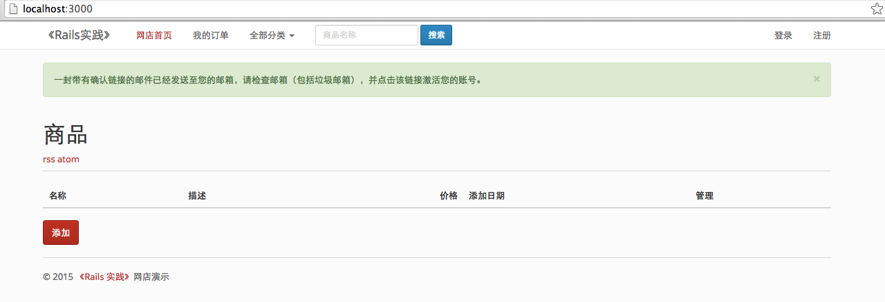

# 3.4 模板引擎的使用

## 概要：

本课时结合商品页面，讲解如何使用简洁安全的模板引擎，以及如何更改邮件模板。

## 知识点：

1. haml
2. slim
3. liquid
4. 邮件模板

## 正文

### 3.4.1 haml

前面的章节里，我们一直使用 erb 作为视图模板，erb 可以让我们在 html 中签入 Ruby 代码。这样做的好处是，我们拿到的页面和设计师提供的页面几乎无任何差别，可以直接增加上我们用 Ruby 写的的逻辑。稍微不好的一点是，html 太多了，稍微处理不好，会缺失标签，而且不易察觉。

这时我们可以使用其他一些方案，[haml](http://haml.info/) 是比较常用的一个。

我们在 Gemfile 中安装 haml：

```
gem 'haml'
```

我们看一下用 haml 写的代码：

```
%section.container
  %h1= post.title
  %h2= post.subtitle
  .content
    = post.content
```

下面是 erb 的写法。

```
<section class=”container”>
  <h1><%= post.title %></h1>
  <h2><%= post.subtitle %></h2>
  <div class=”content”>
    <%= post.content %>
  </div>
</section>
```

可见 haml 节省了我们大量的代码，而且更接近 Ruby 语法。我们看几个 haml 常用的写法：

```
.title= "I am Title"
#title= "I am Title"
```

它会输出为：

```
 <div class="title">I am Title</div>
 <div id="title">I am Title</div>
```

下面是显示 ul 列表，注意，haml 的缩进是2个空格：

```
%ul
  %li Salt
  %li Pepper
```

这是循环的例子：

```
- (42...47).each do |i|
  %p= i
%p See, I can count!
```

我们如果想在项目里使用 haml 文件，只需要创建一个 `xxx.html.haml` 文件即可，这是一个完整的 haml 例子：

```
!!!
%html{html_attrs}
  %head
    %title Hampton Catlin Is Totally Awesome
    %meta{"http-equiv" => "Content-Type", :content => "text/html; charset=utf-8"}
  %body
    %h1
      This is very much like the standard template,
      except that it has some ActionView-specific stuff.
      It's only used for benchmarking.
    .crazy_partials= render :partial => 'templates/av_partial_1'
    / You're In my house now!
    .header
      Yes, ladies and gentileman. He is just that egotistical.
      Fantastic! This should be multi-line output
      The question is if this would translate! Ahah!
      = 1 + 9 + 8 + 2 #numbers should work and this should be ignored
    #body= " Quotes should be loved! Just like people!"
    - 120.times do |number|
      - number
    Wow.|
    %p
      = "Holy cow        " + |
        "multiline       " + |      
        "tags!           " + |
        "A pipe (|) even!"   |
      = [1, 2, 3].collect { |n| "PipesIgnored|" }
      = [1, 2, 3].collect { |n|     |
          n.to_s                    |
        }.join("|")                 |
    %div.silent
      - foo = String.new
      - foo << "this"
      - foo << " shouldn't"
      - foo << " evaluate"
      = foo + " but now it should!"
      -# Woah crap a comment!

    -# That was a line that shouldn't close everything.
    %ul.really.cool
      - ('a'..'f').each do |a|
        %li= a
    #combo.of_divs_with_underscore= @should_eval = "with this text"
    = [ 104, 101, 108, 108, 111 ].map do |byte|
      - byte.chr
    .footer
      %strong.shout= "This is a really long ruby quote. It should be loved and wrapped because its more than 50 characters. This value may change in the future and this test may look stupid. \nSo, I'm just making it *really* long. God, I hope this works"
```

这个文件来自 [这里](https://github.com/haml/haml/blob/master/test/templates/action_view.haml)，你可以在这里找到它的源码。

在 [这里](http://haml.info/docs/yardoc/file.REFERENCE.html) 还有一份文档。

如果打算把现有的 erb 转成 haml，可以使用 haml 提供的一个命令行工具 html2haml，我们在 Gemfile 里安装台：

```
gem 'html2haml'
```

在命令行里，直接使用它：

```
% html2haml -e index.erb index.haml
```

-e 参数，可以把 erb 模板转成 haml。

这里有一个 [网站](http://html2haml.herokuapp.com/)，是在线把 html/erb 转成 haml。如果需要把 haml 转回 erb 模板，可是试试 [这个网站](https://haml2erb.org/)。

为了方便的使用 haml，尤其在使用 scaffold 或者 generate 创建文件的时候，自动创建 haml，而不是 erb，可以安装 [haml-rails](https://github.com/indirect/haml-rails)：

```
gem "haml-rails"
```

它为我们提供了一个快速转换的工具：

```
rake haml:erb2haml
```

它可以把所有 views 文件夹下的 erb 模板，转成 haml。

### 3.4.2 slim

和 haml 类似，[slim](http://slim-lang.com/) 更加的简洁，从它的官网首页可以看到它的代码风格，而且比 haml 又少了一些分隔符。

```
doctype html
html
  head
    title Slim Examples
    meta name="keywords" content="template language"
    meta name="author" content=author
    javascript:
      alert('Slim supports embedded javascript!')

  body
    h1 Markup examples

    #content
      p This example shows you how a basic Slim file looks like.

      == yield

      - unless items.empty?
        table
          - for item in items do
            tr
              td.name = item.name
              td.price = item.price
      - else
        p
         | No items found.  Please add some inventory.
           Thank you!

    div id="footer"
      = render 'footer'
      | Copyright © #{year} #{author}
```

这是官网首页给出的代码示例，这里有它详尽的[使用手册](http://www.rubydoc.info/gems/slim/frames)。

slim 为我们提供了两个工具：[html2slim](https://github.com/slim-template/html2slim) 可以把 html/erb 转换成 slim，[haml2slim](https://github.com/slim-template/haml2slim) 把 haml 转成 slim。

和 haml-rails 一样，[slim-rails](https://github.com/slim-template/slim-rails) 可以默认生成 slim 模板。

在这里，有一个 [在线工具](http://html2slim.herokuapp.com/)，把 html 转换成 slim。

### 3.4.3 liquid

上面两个模板引擎（template engine）是针对开发者的，因为我们编写的代码是不会交付给使用者的，但是，如果我们需要把页面开放给使用者随意编辑，以上提到的 erb，haml，slim 是绝对不可以的，因为使用者可以在页面里这么写：

```
<%= User.destroy_all %>
```

那么，如何给使用者一个安全的模板来自由编辑呢？ [liquid](http://liquidmarkup.org/) 是一个很好的方案。liquid 是著名的电商网站 Shopify 设计并开源的安全模板引擎。

liquid 不允许执行危险的代码，所以可以随意交给使用者编辑并且直接渲染成页面，它还可以保存到数据里，这样可以实现在线编辑模板，它将逻辑代码和表现代码分开，如果你熟悉 php 的 smarty 模板，那么你会发现 liquid 就是 Ruby 版的 smarty。

我们看一个例子：

```
 <ul id="products">
   
     <li>
       <h2>{{ product.name }}</h2>
       Only {{ product.price | price }}
       {{ product.description | prettyprint | paragraph }}
     </li>
   
 </ul>
```

当我们渲染这段模板时，可以

```
@template = Liquid::Template.parse(template) # template 就是上面的代码，可以直接从数据库读取出来
@template.render('products' => Product.all) # 传入 products 变量，这是由我们控制的，用户可以在模板中随意调用
```

liquid 的源码在 [https://github.com/Shopify/liquid](https://github.com/Shopify/liquid)，在 [https://github.com/Shopify/liquid/wiki/Liquid-for-Designers](https://github.com/Shopify/liquid/wiki/Liquid-for-Designers)，有非常详尽的使用方法。

和 haml-rails，slim-rails 一样，liquid 也有自己的：

```
gem 'liquid-rails'
```

它可以方便的使用 Rails 中的 Helper 和 Tag，实现 Drop Class，并且编写 Rspec 测试。

Rails 使用 [Tilt](https://github.com/rtomayko/tilt) 这个 Gem 来处理各种模板引擎，Tilt 是一个接口，支持几十个模板引擎，我们只是提到了其中较常用的三个。

使用 tilt 方便我们在 Rails 集成各种模板引擎，不过实际开发的时候，我们要注意他们的效率问题。这里有一份测试数据：

```
# Linux + Ruby 1.9.2, 1000 iterations

                      user     system      total        real
(1) erb           0.680000   0.000000   0.680000 (  0.810375)
(1) erubis        0.510000   0.000000   0.510000 (  0.547548)
(1) fast erubis   0.530000   0.000000   0.530000 (  0.583134)
(1) slim          4.330000   0.020000   4.350000 (  4.495633)
(1) haml          4.680000   0.020000   4.700000 (  4.747019)
(1) haml ugly     4.530000   0.020000   4.550000 (  4.592425)

(2) erb           0.240000   0.000000   0.240000 (  0.235896)
(2) erubis        0.180000   0.000000   0.180000 (  0.185349)
(2) fast erubis   0.150000   0.000000   0.150000 (  0.154970)
(2) slim          0.050000   0.000000   0.050000 (  0.046685)
(2) haml          0.490000   0.000000   0.490000 (  0.497864)
(2) haml ugly     0.420000   0.000000   0.420000 (  0.428596)

(3) erb           0.030000   0.000000   0.030000 (  0.033979)
(3) erubis        0.030000   0.000000   0.030000 (  0.030705)
(3) fast erubis   0.040000   0.000000   0.040000 (  0.035229)
(3) slim          0.040000   0.000000   0.040000 (  0.036249)
(3) haml          0.160000   0.000000   0.160000 (  0.165024)
(3) haml ugly     0.150000   0.000000   0.150000 (  0.146130)

(4) erb           0.060000   0.000000   0.060000 (  0.059847)
(4) erubis        0.040000   0.000000   0.040000 (  0.040770)
(4) slim          0.040000   0.000000   0.040000 (  0.047389)
(4) haml          0.190000   0.000000   0.190000 (  0.188837)
(4) haml ugly     0.170000   0.000000   0.170000 (  0.175378)

1. Uncached benchmark. Template is parsed every time.
   Activate this benchmark with slow=1.

2. Cached benchmark. Template is parsed before the benchmark.
   The ruby code generated by the template engine might be evaluated every time.
   This benchmark uses the standard API of the template engine.

3. Compiled benchmark. Template is parsed before the benchmark and
   generated ruby code is compiled into a method.
   This is the fastest evaluation strategy because it benchmarks
   pure execution speed of the generated ruby code.

4. Compiled Tilt benchmark. Template is compiled with Tilt, which gives a more
   accurate result of the performance in production mode in frameworks like
   Sinatra, Ramaze and Camping. (Rails still uses its own template
   compilation.)
```

该数据来自：[https://ruby-china.org/topics/634](https://ruby-china.org/topics/634)

选择哪个模板引擎，还是直接使用 erb，需要视情况而定了。

### 3.4.4 devise 的邮件模板

Devise 除了提供用户注册和登录功能，还可以通过邮件激活用户。这里，我们可以自己定义邮件模板中的内容。
 
我们修改一下 User 中关于 Devise 的配置：
 
```
devise :database_authenticatable, :registerable,
       :recoverable, :rememberable, :trackable, :validatable,
       :confirmable
```

我们增加了一个新的选项：:confirmable。

我们配置下邮件发送的信息，这里我们只在开发环境（development）配置，我们打开 `config/environments/development.rb`：

```
  config.action_mailer.default_url_options = { host: 'localhost', port: 3000 }
  config.action_mailer.delivery_method = :smtp
  config.action_mailer.smtp_settings = {
    address:              'smtp.163.com',
    port:                 25,
    domain:               '...',
    user_name:            '...@163.com',
    password:             '...',
    authentication:       :plain,
    enable_starttls_auto: true
  }
```

同时，我们还需要修改 user 创建时的 migration 文件，打开 `db/migrate/xxxx_devise_create_users.rb`，我们取消注释这个部分：

```
## Confirmable
  t.string   :confirmation_token
  t.datetime :confirmed_at
  t.datetime :confirmation_sent_at
  t.string   :unconfirmed_email # Only if using reconfirmable
```

注意，xxxx 是日期时间戳，表示这个文件创建的日期。devise 已经为我们添加了 `confirmable` 需要的字段，我们不必自己添加。这里有一个问题，我们已经运行过数据库文件了，这里是修改旧文件，我们不能直接更新文件，这里我们可以删掉旧的数据库，其实在开发环境，我们可以经常重建数据库：

```
rake db:drop
rake db:create
rake db:migrate
rake db:seed
```

还记得 `db/seeds.rb` 这个文件吧，我们可以把一些默认数据写到 seed 里，或者一些测试数据，比如我们添加50个商品信息，来测试分页等效果是否正确，或者初始化几十个商品类别等。这样，重建数据库时，不必担心默认数据的丢失。

我们再编辑下 devise 的配置文件，它在 `config/initializers/devise.rb`：

```
config.mailer_sender = '...@163.com'
...
config.mailer = 'Devise::Mailer'
```

我们重新启动 Rails 服务，注册一个账号，这时我们观察终端，可以看到邮件发送的信息：

```
Sent mail to hi@liwei.me (2468.6ms)
Date: Mon, 02 Mar 2015 14:04:57 +0800
From: master@...
Reply-To: master@...
To: hi@liwei.me
Message-ID: <54f3fd89f0f84_62213ffdf44a34e08208d@macbook.local.mail>
Subject: =?UTF-8?Q?=E6=9D=A5=E8=87=AAezcms=E7=9A=84=E6=B3=A8=E5=86=8C=E7=A1=AE=E8=AE=A4=E9=82=AE=E4=BB=B6?=
Mime-Version: 1.0
Content-Type: text/html;
 charset=UTF-8
Content-Transfer-Encoding: 7bit

 <p>Welcome hi@liwei.me!</p>

 <p>You can confirm your account email through the link below:</p>

 <p><a href="http://localhost:3000/users/confirmation?confirmation_token=FNMGvy_VnNfyhHKz_LKY">Confirm my account</a></p>
```

我们页面上，也会得到这样的提示：



为了让我们的邮件看起来更友好，我们编辑 `app/views/users/mailer/confirmation_instructions.html.erb`：

```
 <p>你好 <%= @email %>!</p>

 <p>请点击下面的确认链接，验证您的邮箱:</p>

 <p><%= link_to "验证我的邮箱", confirmation_url(@resource, confirmation_token: @token) %></p>
```

你可以再试试看。不过这种配置可能会被当做垃圾邮件拒收，或者直接被放到垃圾邮件中。在后面的章节里，我们会介绍其他的方式发送邮件。

如果你不能通过邮件激活这个用户，比如那些在 seed 中添加的用户，没关系，`rails c` 进入控制台：

```
u = User.last [1]
u.confirm! [2]
```
* [1] 找到这个用户，更多方法在下一章陆续介绍
* [2] `confirm!` 方法激活用户

更多邮件配置，可以查看 [http://guides.rubyonrails.org/configuring.html#configuring-action-mailer](http://guides.rubyonrails.org/configuring.html#configuring-action-mailer)


