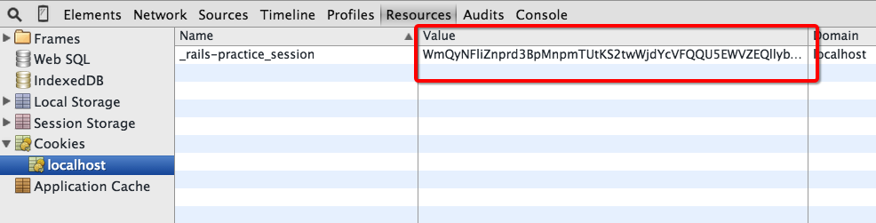
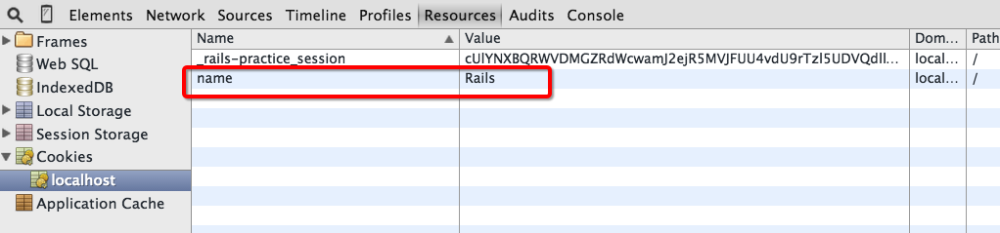

# 第五章 Rails 中的控制器

## 课程概要：

本课程通过对控制器的学习，了解 Rails 如何通过处理请求和作出相应来控制逻辑的，并且完成网店中购物和支付流程。

## 知识点：

1. 控制器中的请求和相应
2. 控制器中的方法

## 课程背景

控制器 Controller 是 MVC 中调度员的角色，它接收客户端发送过来的请求，并且通过我们编写的代码作出相应，实现业务逻辑的控制。

# 5.1 控制器中的请求和相应

## 概要

本课时讲解控制器中如何处理传入的参数和相应，并且介绍在请求和相应的过程中，如何处理请求参数，使用 sesson，设置 etag 缓存和使用 csrf 确保数据来源安全。

## 知识点

* request
* response
* params
* respond_to
* session
* cookies
* etag
* csrf

## 正文

### 5.1.1 Action Pack

[Action Pack](https://github.com/rails/rails/tree/master/actionpack) 是 Rails 种又一个核心的 Gem，它可以处理 web 请求，使用 routes 中定义的规则调用控制器（Controller）及方法（Action），并且自动判断请求类型，做出对应的相应。

Rails 中的控制器，指的就是处理请求及做出相应。

### 5.1.2 Request 类

`ActionDispatch::Request` 类是对 web 请求的包装类，它有两个常用的方法：

```
request.headers["Content-Type"] # => "text/plain"
```

`headers` 包含了请求的头信息。

```
request.parameters
```

它会返回请求的参数，不过我们并不直接使用它，而是使用 `params` 方法获得，这在稍后介绍。

Request 类的源代码在[这里](https://github.com/rails/rails/blob/master/actionpack/lib/action_dispatch/http/request.rb)。

### 5.1.3 Response 类

`ActionDispatch::Response` 类代表了响应结果，它也有常用的方法，不过我们更经常用的是 Controller 中的 action 和回调。在一些测试代码中，我们经常使用 response 实例。

比如，我们测试商品删除之后，会返回到商品列表，我们的测试代码是：

```
RSpec.describe ProductsController, type: :controller do
  ...
  describe "DELETE #destroy" do
	it "redirects to the products list" do
      product = Product.create! valid_attributes
      delete :destroy, {:id => product.to_param}, valid_session
      expect(response).to redirect_to(products_url)
    end
  end
end
```

Request 和 Response 在我们的业务逻辑代码中并不不常用到，下面介绍的内容，是我们在编写控制器代码时，经常遇到的。

### 5.1.4 strong paramaters

Controller 是控制器的概念，所谓控制，指在网络传输中，接收参数和做出相应。Controller 有两种方式接收参数：GET 和 POST。两种方式均可通过 `params` 读取传递的内容。

在 Rails3之前的版本中，当接收传递的参数，用来更新资源属性时，可以设定 Model 的属性白名单，非报名单上的属性不允许通过参数传递的方式修改，比如：

```
class User < ActiveRecord::Base
  attr_accessible :name
end
```

在 Rails 4 之后，这个方法转为 [gem](https://github.com/rails/protected_attributes)，不再是 Rails 4 的核心功能，但将在 Rails 5 中重新回到核心功能中。现在，使用 `permit` 方法来过滤参数。使用 scaffold 创建的 Controller 默认使用了该方法：

```
class ProductsController < ApplicationController
  def create
    @product = Product.new(product_params)
    ...
  private
    def product_params
      params.require(:product).permit(:name, :price, :description)
    end
end
```

`permit` 可以设定关联关系的属性：

```
params.require(:product).permit(:name, :price, :description, variants_attributes: [:price, :size, :id, :_destroy])
```

`:id` 和 `:_destroy` 适用于上一章介绍的 `accepts_nested_attributes_for` 方法。


### 5.1.5 respond_to 方法

Controller 响应请求有多种结果，响应返回 `Status Code`，常见的有 200（成功响应），302（跳转），404（未找到资源），500（内部错误）。更多响应 Code 参考 [3.3 视图中的 AJAX 交互](../Chapter_3/3.3.md)。

一个 controller 的 action 对应一个请求，这样可以保持我们业务逻辑代码清晰，易维护。一个 action 可以响应一个请求的多中类型，这在我们第三章里已经有了介绍和演示。

Controller 使用 `respond_to` 方法，针对每一种请求类型，做出响应：

```
respond_to do |format|
  if @product.save
    format.html { redirect_to @product, notice: 'Product was successfully created.' }
    format.json { render :show, status: :created, location: @product }
  else
    format.html { render :new }
    format.json { render json: @product.errors, status: :unprocessable_entity }
  end
  format.js
end
```

当我们处理多个资源时，每个资源的 `create` 和 `update` 等资源方法，大多都具备相同的逻辑代码。除了特定的业务逻辑，他们都会响应典型的资源操作。 Rails 4.2 之前提供了 `respond_with` 访问，4.2 之后将它转为一个 gem，我们安装这个 gem：

```
gem "responders"
```

并且创建文件：

```
% rails g responders:install
      create  lib/application_responder.rb
      insert  config/application.rb
     prepend  app/controllers/application_controller.rb
      insert  app/controllers/application_controller.rb
      create  config/locales/responders.en.yml
```

默认，它只支持 :html，因为我们演示时，又使用到了 :json 和 :js，还有 :xml，我们将这些类型添加上：

```
class ApplicationController < ActionController::Base
  self.responder = ApplicationResponder
  respond_to :html, :xml, :json, :js
```

我们将刚才 `respond_to` 方法改成 `respond_with`，精简重复的代码（Dry up your code）：

```
def create
  @product = Product.create(product_params)
  respond_with(@product)
end
```

在 [6.4 I18n](../Chapter_6/6.4.md) 中，我们讲 I18n 文件做了整理，这里我们把 generator 创建的语言包，按照 6.4 一节中介绍的方式进行管理，并且增加中文提示。如此，我们不必为每个资源创建、修改等操作各自编写语言提示了。

### 5.1.6 session 和 cookies

从一个请求到另一个请求，Rails 使用 Session 来保存一些简单的信息，比如 user_id 等。同时，也可以用 cookies 保存该信息。

当 Rails 项目创建的时候，它会有一个默认的 cookie name，这在 `config/initializers/session_store.rb` 中：

```
Rails.application.config.session_store :cookie_store, key: '_rails-practice_session'
```

这里，我们用 `cookie_store` 来储存 session，当我们在项目中保存 session 的时候，数据会保存在这个 cookie 中。



在 Rails 2 之前，可以 decode 这个内容，查看其中 session 的内容：

```
require 'rack'
cookie = "WmQyNFliZnprd3..."
Rack::Session::Cookie::Base64::Marshal.new.decode(cookie)
=> {"session_id"=>"d3b17...", "user_id"=>"123", "_csrf_token"=>"rtkofT..."}
```

因为在 Rails 3 中已经增加了 `secret_key_base`，所以无法直接 decode 内容了。

但是，如果单独使用一个 cookie 来记录数据，默认是不经过任何加密的：

```
cookies[:name] = "Rails"
```



如果这个数据不想被暴露，需要单独加密：

```
cookies.signed[:name] = "Rails"
cookies.permanent.signed[:name] = "Rails" [1]
```

`permanent` 会让这个 cookie 有20年的有效时间。

Cookie 的 [api](http://api.rubyonrails.org/classes/ActionDispatch/Cookies.html) 文档在这里。

如果我们在 Cookie 中保存了过多数据，会超出 cookie 的大小限制，这时我们可以更改 session 的保存方式，比如使用 redis，memcached 等。

```
Rails.application.config.session_store :redis_store, servers: {
  host: "127.0.0.1",
  port: 6379,
  namespace: "store_session"}
```

在 [6.2 缓存](../Chapter_6/6.2.md) 中有其他详细的介绍。

### 5.1.7 etag

Controller 响应的时候，header 中会包含 etag 属性，根据这个属性，浏览器会判断该内容是否修改。

```
headers['ETag'] = Digest::MD5.hexdigest(body)
```

但对 Rails 的布局和模板而言，经常包含变动的内容，比如登录后会显示用户名称，未登录显示登录连接。
 并且，body 可能会很大，md5 时间长。

我们可以针对资源，单独增加 etag：

```
def show
  fresh_when([@product, current_user.try(:id)])
end
```

也可以将它精简：

```
class ProductsController < ApplicationController
  etag { current_user.try(:id) }
  ...
  def show
    fresh_when(@product)
  end
```

如果我们仅提供数据，比如 api，[可以去掉模板](http://api.rubyonrails.org/classes/ActionController/ConditionalGet.html#method-i-fresh_when)：

```
fresh_when @product, template: false
```

### 5.1.8 csrf

在 Controller 接收请求数据的时候，安全机制会处理跨站请求伪造（cross-site request forgery，简称 CSRF）。在我们的布局（layout）页面，你可能已经看到这样一个辅助方法：

```
<%= csrf_meta_tags %>
```

打开页面的源码，我们可以看到：

```
<meta name="csrf-param" content="authenticity_token" />
<meta name="csrf-token" content="O3Li25wJK0buXKRQRX4CzpAWheQIQ4VknCPe3KwNIFkIuUsbBApxl2jVVTd9IcmzR8oHLZI0qZpO39aLdNaBAQ==" />
```

当我使用表单的辅助方法 `form_for` 和 `form_tag` 时，表单会自动创建一个隐藏控件

```
<input type="hidden" name="authenticity_token" value="GI5YwKDhQA4pMlLRaUlpHugYdL5ygNe3Co6TL8PvZDsrRfEAOOIa36+7o7ZRFqJjP8T2d+j3+0nYcpt4GzTFYw==">
```

当我们使用 `remote: true` 时，这个控件又消失了，这样是不是不安全？不，ujs 在提交的时候，为我们自动补充上了 `authenticity_token` 参数。

更多 Rails 安全问题，可以参考这里 [http://guides.ruby-china.org/security.html](http://guides.ruby-china.org/security.html)。

注：

感谢 [Rails 4 - Zombie Outlaws](https://www.codeschool.com/courses/rails-4-zombie-outlaws)，本节 3，5 的内容灵感来自。

