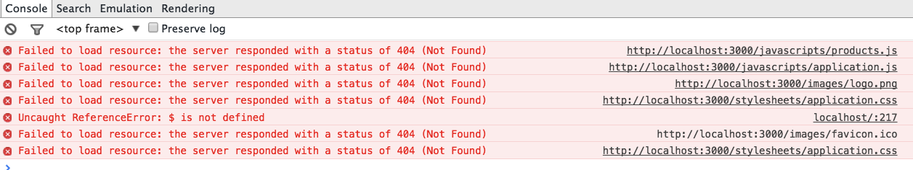

# 第六章 Rails 的配置及部署

## 课程概要：

本课程讲解 Rails 中 Assets 管理，异步任务及邮件发送，缓存，多语言包，以及如何在服务器中部署。

## 知识点：

1. Assets 管理
2. 缓存及缓存服务
3. 异步任务及邮件发送
4. I18n
5. 生产环境部署
6. 常用 Gem 排行

## 课程背景

在 Rails 上线前，需要做好一些配置工作，并且实现常见的商用功能，如邮件发送，语言包，快捷部署等，同时要了解如何在 linux 服务器上部署 Rails 程序。

# 6.1 Assets 管理

## 概要：

本课时讲解如何管理 Rails 中的 css，js 等静态文件。

## 知识点：

1. assets 编译
2. 静态文件
3. cdn

## 正文

当第一次用 production 运行 Rails 时（`rails s -e production`），很可能提示找不到资源：



因为我们还没有 `编译` 这些静态资源，说`编译`是因为 Rails 默认使用了 [sprockets-rails](https://github.com/rails/sprockets-rails) 这个 gem 来管理 Assets 文件。

### 6.1.1 Assets 管理

Rails 的 Assets 包括已经看到的 stylesheets，javascript 和 images，我们还可以增加 fonts。`sprockets-rails` 提供了几个管理这些资源的 Rake 任务。其中最常用的是 `rake assets:precompile`。它的含义是，编译所有在 `config.assets.precompile` 中定义的资源。

Rails 默认加载 `app/assets`, `lib/assets` 和 `vendor/assets` 中的文件到 precompile 路径中。我们引用这些资源文件的文件，叫 `manifest file`，可以理解为白名单。这里有两个引用命令：

`app/assets/styleshetts/application.css`

```
*= require_self
*= require_tree .
```

这是一种简单的引用，`require_self` 会先加载自身定义的内容，然后加载其他所有目录下的文件，也就是 `require_tree .` 中可以找到的文件。但是，我们引用的是 bootstrap 文件，它有变量文件，而 `require_tree` 命令不一定会优先编译这个变量文件，所以会出现：

```
Less::ParseError: variable @navbar-default-bg is undefined
```

这样的错误。而且当项目的 assets 文件越来越多，引用的各种 sass 文件和 less 文件存在互相覆盖的时候，`require_tree` 会让这种引用杂乱，且文件臃肿庞大。

这时我们可以明确引用的文件，比如：

```
 *= require_self [1]
 *= require simplex/loader
 *= require simplex/bootswatch
 *= require bootstrap_and_overrides
```

如果我们在该文件里不写其他 css，可以把 [1] 去掉。

如果我们在 `application.css` 中写了一些 css，又 require 了其他文件，如果不使用 `require_self`，编译文件中我们写的 css 不是出现在顶部而可能出现在底部。`require_self` 会保持编译结果顺序和引用顺序相同。

这样运行该命令，会把这些资源编译到 `public/assets` 目录下。那么，其他没有没有在此被引入，而也要使用的文件，该如何被编译呢？

Rails 4 将 assets 的配置文件单独放置在 `config/initializers/assets.rb` 中：

```
Rails.application.config.assets.precompile += %w( products.js )
Rails.application.config.assets.precompile += %w( cerulean.js cerulean.css )
```

`products.js` 文件中定义了两个方法，它只在一个页面上使用，就没必要编译到整体文件里，只要在需要它的页面引用即可：

`app/views/products/index.html.erb`

```
<%= javascript_include_tag "products" %>
```

总结一下，使用 白名单加载的 assets 文件，可以认为是 “编译+合并” 模式，这适合全局都使用的css 和 js。单独写入 `config.assets.precompile` 的文件是局部引用。

### 6.1.2 使用字体

因为我们把 bootstrap 中定义的变量放到了 assets 下，所以需要单独引用 bootstrap 3 中使用的 `Glyphicons` 字体：

```
@font-face {
   font-family: 'Glyphicons Halflings';
   src: font-url('glyphicons-halflings-regular.eot');
   src: font-url('glyphicons-halflings-regular.eot?#iefix') format('embedded-opentype'),
      font-url('glyphicons-halflings-regular.woff') format('woff'),
      font-url('glyphicons-halflings-regular.ttf') format('truetype'),
      font-url('glyphicons-halflings-regular.svg#glyphicons_halflingsregular') format('svg');
}
```

如果不做任何修改，则不必再次引用，gem 会自动把它们包含进来。

如果使用新的字体或图标，需要把新字体文件放到 `assets/fonts` 中，然后定义：

```
@font-face {
  font-family: 'Trajan Pro';
  font-style: normal;
  src: font-url('trajan_pro/trajan_pro.woff');
  src: font-url('trajan_pro/trajan_pro.eot?#iefix') format('embedded-opentype'),
    font-url('trajan_pro/trajan_pro.woff') format('woff'),
    font-url('trajan_pro/trajan_pro.ttf') format('truetype'),
    font-url('trajan_pro/trajan_pro.svg#Regular') format('svg');
  font-weight: normal;
  font-style: normal;
}
```

这是一款购买的商业字体，引用的时候：

```
<font face="Trajan Pro"><%= product.name %></font>
```

### 6.1.3 CDN

如果我们不引用编译的文件，直接使用 `application.js` 和 `application.css` 不可以么？这在开发环境下自然没问题，但是在产品环境下，尤其遇到缓存和 cdn 时，会造成加载缓慢，无法及时清理过期时间的问题。

首先，Rails 默认启用了 assets 的 digest 选项，这样编译文件的时候，会带有 md5 字符，形象的叫做 `指纹`。当我们修改内容之后，其该值会变动，生成新的文件名，并且编译最新的文件。如果我们用 nginx 来作为 web server，可以针对这种文件设置缓存，如果使用外部 cdn，可以把最新的文件发布到 cdn 中（回源模式会自动从服务器读取，无需发布）。

在 nginx 的配置：

```
location ~ ^/assets/ {
  expires 1y;
  add_header Cache-Control public;

  add_header ETag "";
  break;
}
```

在产品环境使用 cdn 时，需要更改配置：

```
config.action_controller.asset_host = "http://cdn.domain.com"
```

当使用 xxx_url 这个 routes helper 时，会自动带上 cdn 的地址。

